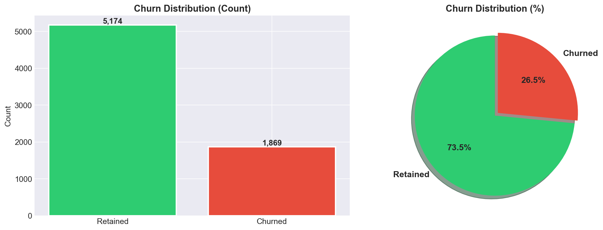
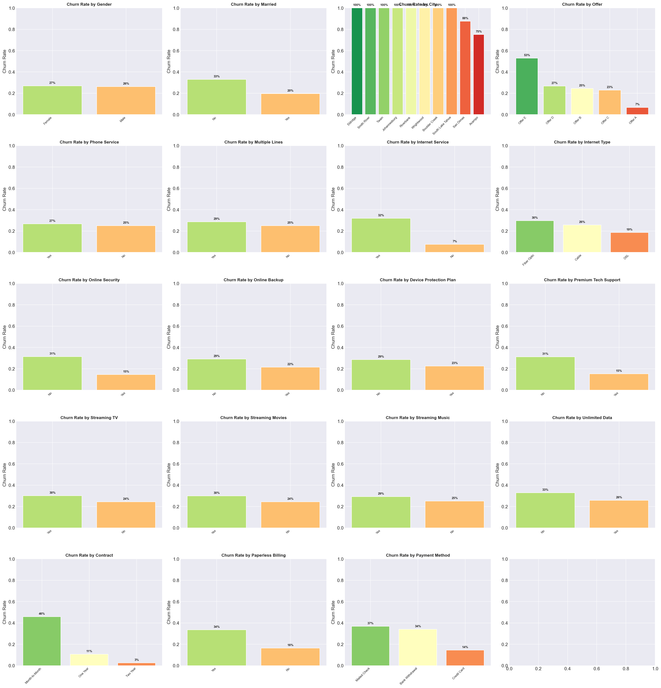
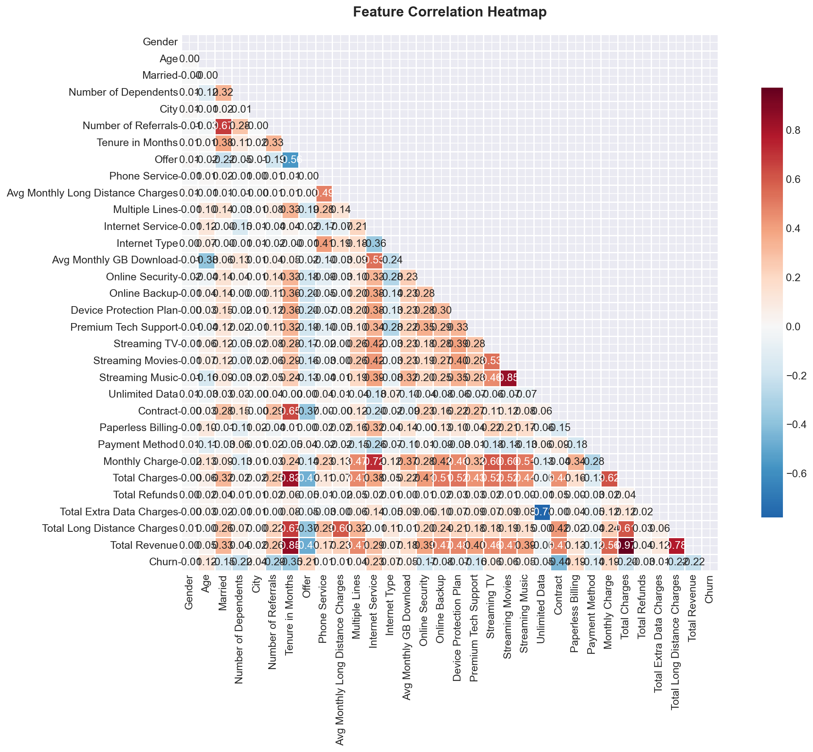
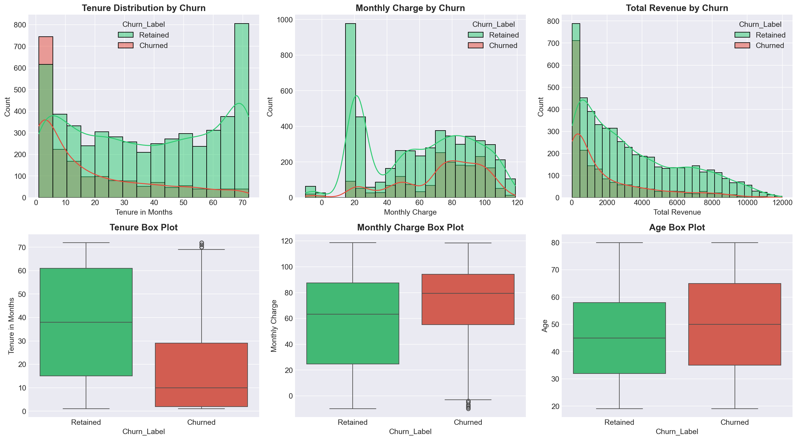
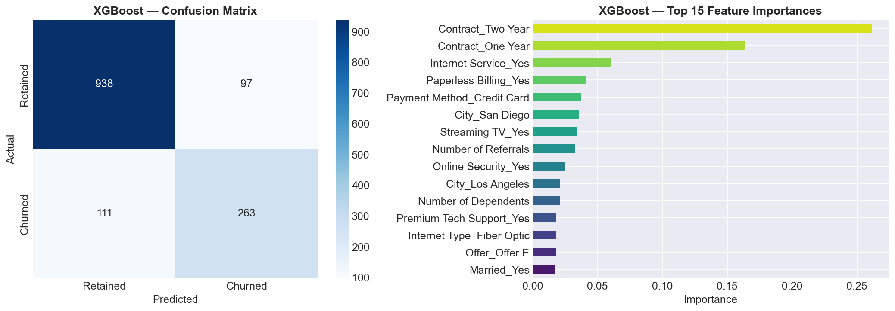

# Telco Customer Churn Prediction

A Flask web application that predicts telecom customer churn using a trained machine learning model. The project includes:

- A backend API for model metadata and predictions
- A modern frontend dashboard for interactive risk scoring
- Saved model artifacts and analysis outputs
- A notebook-based analysis workflow

## Features

- Predicts whether a customer is likely to churn
- Returns churn and retention probabilities
- Provides risk level classification (Low, Medium, High)
- Highlights risk factors (for example short tenure, high monthly charges)
- Displays model metrics and feature importance in the UI

## Tech Stack

- Python
- Flask
- scikit-learn model artifacts (joblib + pickle)
- Pandas and NumPy
- HTML, CSS, JavaScript frontend

## Project Structure

- app.py: Flask app and prediction API
- templates/index.html: Frontend page
- static/style.css: UI styling
- static/script.js: Frontend logic and API integration
- Telco_Customer_Churn.csv: Source dataset
- churn_analysis.ipynb: Data analysis and model training notebook
- churn_model.pkl: Trained model
- scaler.pkl: Feature scaler
- pipeline_info.pkl: Pipeline metadata including feature names
- model_results.json: Model comparison metrics
- feature_importances.json: Feature importance values
- *.png: EDA/model visualization outputs

## Prerequisites

- Python 3.9+
- pip

## Installation

1. Open a terminal in this project folder.
2. Create and activate a virtual environment.

Windows PowerShell:

```powershell
python -m venv .venv
.\.venv\Scripts\Activate.ps1
```

3. Install dependencies:

```powershell
pip install flask flask-cors pandas numpy scikit-learn joblib xgboost
```

Notes:

- xgboost is included because model comparison results include XGBoost.
- If you only run inference with existing artifacts, your required packages depend on how the saved model was serialized.

## Run the App

From the project root:

```powershell
python app.py
```

Then open:

- http://127.0.0.1:5000/

## API Endpoints

### GET /api/model-info

Returns model metadata used by the dashboard:

- model_name
- accuracy
- roc_auc
- f1_score
- feature_importances
- model_results

### POST /api/predict

Predict churn from customer attributes.

Example request body:

```json
{
  "gender": "Male",
  "SeniorCitizen": "No",
  "Partner": "Yes",
  "Dependents": "No",
  "tenure": 12,
  "PhoneService": "Yes",
  "MultipleLines": "No",
  "InternetService": "Fiber optic",
  "OnlineSecurity": "No",
  "OnlineBackup": "No",
  "DeviceProtection": "No",
  "TechSupport": "No",
  "StreamingTV": "Yes",
  "StreamingMovies": "Yes",
  "Contract": "Month-to-month",
  "PaperlessBilling": "Yes",
  "PaymentMethod": "Electronic check",
  "MonthlyCharges": 85.0,
  "TotalCharges": 1020.0
}
```

Example response:

```json
{
  "success": true,
  "prediction": "Churn",
  "churn_probability": 78.45,
  "retention_probability": 21.55,
  "risk_level": "High",
  "risk_factors": [
    "Short tenure (< 12 months)",
    "High monthly charges"
  ]
}
```

## Notes on Artifacts

The app expects these files in the project root:

- churn_model.pkl
- scaler.pkl
- pipeline_info.pkl
- feature_importances.json

Optional:

- model_results.json

If model_results.json is missing, the app falls back to values from pipeline_info.pkl.

## Visualizations

Below are some visualizations used in the project:

### Churn Distribution


### Churn by Category


### Correlation Heatmap


### Numerical Analysis


### Best Model Analysis


## Troubleshooting

- Missing module errors: install the listed Python packages in your active environment.
- Artifact loading errors: confirm all .pkl/.json artifact files exist in the root folder.
- Prediction request errors: verify your POST JSON uses expected keys and value formats.

## Future Improvements

- Add a requirements.txt for reproducible setup
- Add input validation and schema enforcement
- Containerize with Docker
- Add automated tests for API endpoints
